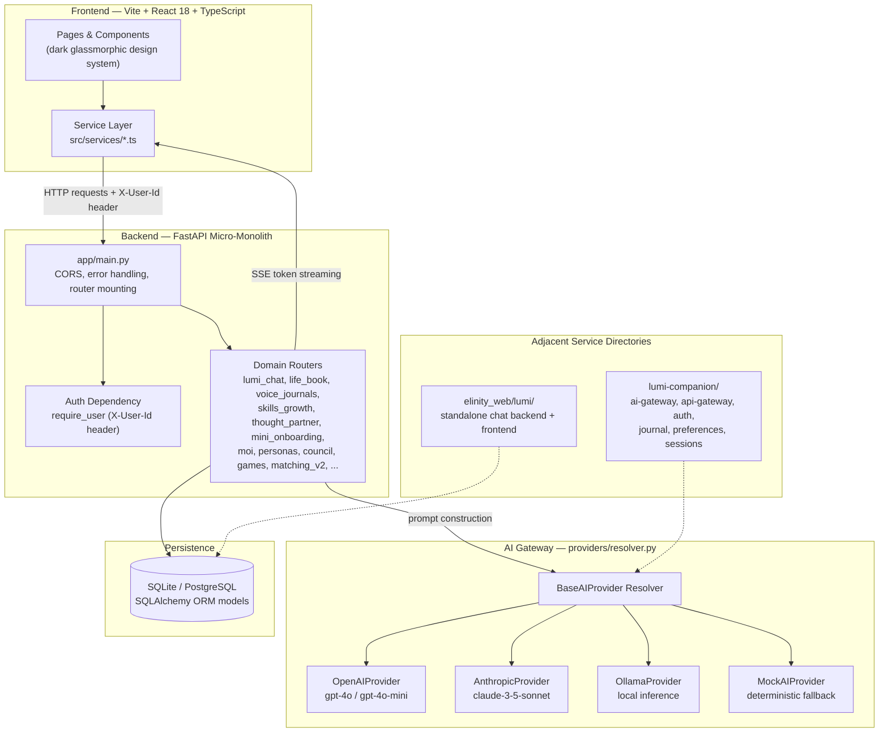
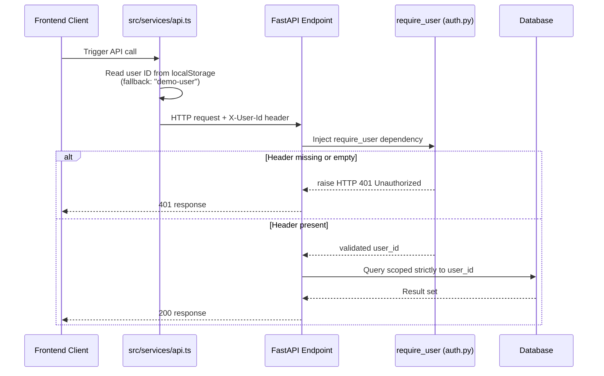
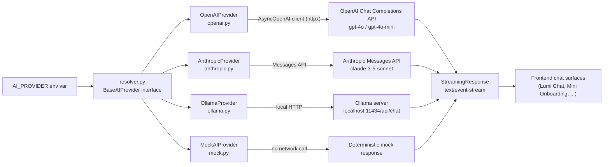
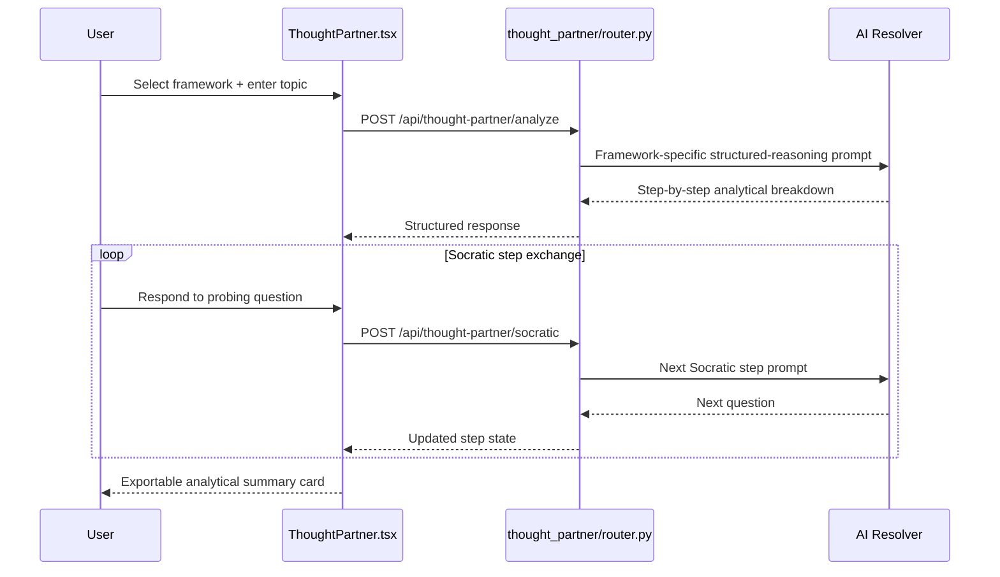
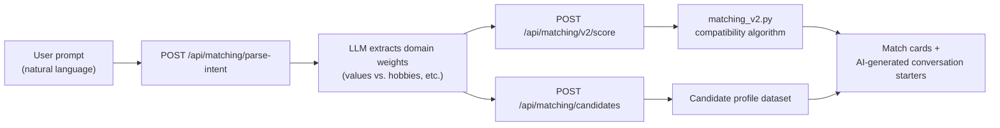
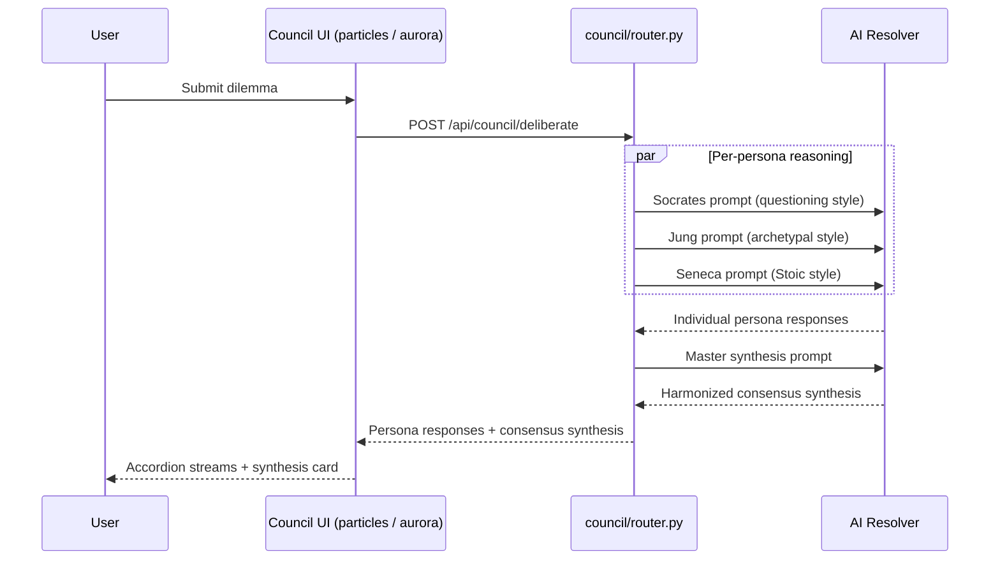

# Elinity Web & Lumi AI Companion

**Complete Technical Architecture & Codebase Documentation**

Elinity is a social connection and relationship-flourishing platform built around Lumi, a persistent AI companion that unifies journaling, self-reflection, matching, coaching, and multiplayer connection games behind a single continuous identity.

[](#tech-stack)
[](#tech-stack)
[](#tech-stack)
[](#ai-gateway--multi-provider-resolver)

---

## Table of Contents

1. [System Overview & Product Architecture](#1-system-overview--product-architecture)
2. [Directory & Repository Structure](#2-directory--repository-structure)
3. [Core Architectural Layers](#3-core-architectural-layers)
   - [3.1 Frontend Architecture & Design System](#31-frontend-architecture--design-system)
   - [3.2 Backend Modular Micro-Monolith Architecture](#32-backend-modular-micro-monolith-architecture)
   - [3.3 Authentication & Authorization System](#33-authentication--authorization-system)
   - [3.4 AI Gateway & Multi-Provider Resolver](#34-ai-gateway--multi-provider-resolver)
4. [Deep-Dive Feature Specifications](#4-deep-dive-feature-specifications)
5. [Configuration, Utilities, & Infrastructure](#5-configuration-utilities--infrastructure)
   - [Environment Variable Reference](#environment-variable-reference)
   - [Local Development Setup & Execution Commands](#local-development-setup--execution-commands)
   - [Build & Deployment Process](#build--deployment-process)
   - [Tech Stack](#tech-stack)
   - [Coding Conventions](#coding-conventions)

---

## 1. System Overview & Product Architecture

Elinity is a next-generation social connection and relationship-flourishing platform powered by an integrated lifelong AI companion named Lumi. The platform is explicitly architected around the paradigm of *flourishing technology*, deliberately distinguishing itself from conventional mental-health wellness apps and transactional productivity bots. Rather than treating self-knowledge, emotional intelligence, and relational vitality as clinical outcomes to be diagnosed and tracked, Elinity treats them as natural downstream results of intentional self-reflection, Socratic dialogue, multiplayer connection games, natural-language matching, and continuous AI companionship. This framing shapes not only the product surfaces themselves but also the tone, vocabulary, and interaction patterns encoded throughout the codebase — from the AI system prompts to the visual language of the UI.

At the center of the platform is Lumi, an AI companion designed to function simultaneously as a thinking partner, confidant, coach, guide, and friend. Lumi is explicitly not a generic, stateless chatbot. It maintains identity continuity across every platform surface through its integration with the **Deep User Model**, a synthesized representation of a user built from their static profile data, core values, psychological signals, life goals, relational patterns, and rolling interaction history. This continuity is what allows Lumi to remain the same coherent presence regardless of which feature a user happens to be engaging with — whether they are recording a voice journal entry, engaging in Socratic dialogue with a historical thinker such as Carl Jung, Seneca, or Friedrich Nietzsche, participating in an interactive pair connection game such as Turncoat or Unsaid, or seeking strategic career perspective through the Thought Partner tool. In every one of these contexts, Lumi serves as the unified intelligence core of the platform, expressed visually and auditively through the Elinity Mind avatar system.

Architecturally, the codebase represents a modern web application paired with a modular backend service layer, rather than a single monolithic script or a loosely connected set of static pages. The frontend is built using **Vite**, **React 18**, **TypeScript**, **TailwindCSS**, and **Framer Motion**, and implements a consistent dark glassmorphic design system across all product surfaces. The backend is implemented in **Python 3.11+** using **FastAPI**, **Uvicorn**, **Pydantic v2**, and **SQLAlchemy**, and is built around a flexible multi-provider LLM abstraction layer that supports OpenAI, Anthropic Claude, local Ollama inference, and deterministic mock fallbacks — allowing the system to remain fully functional in offline or key-less development environments while still supporting production-grade hosted inference.

The remainder of this document walks through the repository structure, the four core architectural layers that every feature is built on top of, a full deep-dive specification for each of the nineteen product features and sub-systems present in the codebase, and the configuration, setup, and deployment information needed to run the platform locally or in production.

---

## 2. System Architecture

The diagram below summarizes how the frontend application, the backend micro-monolith, the AI provider layer, and persistent storage relate to one another. It reflects only the layers and services that are documented in the codebase: the React/Vite frontend, the FastAPI backend with its domain routers, the multi-provider AI resolver, the relational database, and the adjacent `lumi/` and `lumi-companion/` service directories described in the repository structure.



> **Note.** The `lumi-companion/` workspace (`apps/web`, `apps/mobile`, and `services/ai-gateway`, `api-gateway`, `auth`, `journal`, `preferences`, `sessions`) and the standalone `elinity_web/lumi/` service are present in the repository structure as adjacent packages. They are shown here as related service boundaries; the feature-level documentation in Section 4 focuses on the primary `elinity_web` frontend and its `backend/app` FastAPI application, which is where the documented endpoints live.


---

## 2. Directory & Repository Structure

The repository is organized as a multi-workspace codebase covering the root project, the main `elinity_web` application (frontend and backend), the standalone `lumi/` chat service, and the `lumi-companion/` package workspace. The structure below is preserved exactly as documented, with short inline annotations added per top-level folder to clarify the purpose of each area.

```text
Elinity-Web/
├── README.md
├── package.json
├── package-lock.json
├── debug-8c9849.log
├── elinity_web/                        # Primary application workspace (frontend + backend)
│   ├── index.html
│   ├── package.json
│   ├── package-lock.json
│   ├── vite.config.ts
│   ├── tailwind.config.js
│   ├── postcss.config.js
│   ├── tsconfig.json
│   ├── tsconfig.app.json
│   ├── tsconfig.node.json
│   ├── netlify.toml                    # Netlify build + SPA redirect configuration
│   ├── .env
│   ├── .env.example
│   ├── Voice_Journal_Templates.md
│   ├── src/                            # React/TypeScript frontend source
│   │   ├── main.tsx                    # Application entry point
│   │   ├── App.tsx                     # Root component + router providers
│   │   ├── index.css                   # Dark glassmorphic design tokens
│   │   ├── theme.ts                    # Centralized theme constants
│   │   ├── ScrollToTop.tsx
│   │   ├── components/                 # Shared and domain-specific components
│   │   │   ├── Navbar.tsx
│   │   │   ├── Footer.tsx
│   │   │   ├── Hero.tsx
│   │   │   ├── Features.tsx
│   │   │   ├── HowElinityWorks.tsx
│   │   │   ├── WhatIsElinity.tsx
│   │   │   ├── WhatMakesElinitySpecial.tsx
│   │   │   ├── WhoIsElinityFor.tsx
│   │   │   ├── AboutUs.tsx
│   │   │   ├── Contact.tsx
│   │   │   ├── FAQ.tsx
│   │   │   ├── FloatingChat.tsx
│   │   │   ├── JoinWaitList.tsx
│   │   │   ├── KineticText.tsx
│   │   │   ├── OnboardingGuard.tsx
│   │   │   ├── ElinityDiscovery.tsx
│   │   │   ├── ElinityHowToUse.tsx
│   │   │   ├── common/
│   │   │   ├── conversation/
│   │   │   ├── council/                # AI Council ambient visuals
│   │   │   │   ├── InteractiveParticles.tsx
│   │   │   │   ├── SoftAurora.jsx
│   │   │   │   └── LogoLoop.css
│   │   │   ├── experiences/
│   │   │   ├── games/
│   │   │   ├── lifebook/
│   │   │   │   └── EntryComposer.tsx
│   │   │   ├── matching/
│   │   │   ├── mini-onboarding/
│   │   │   ├── project-connector/
│   │   │   ├── trips/
│   │   │   ├── ui/
│   │   │   └── voice-journals/
│   │   ├── pages/                      # Route-level page views
│   │   │   ├── ElinityLanding.tsx
│   │   │   ├── LumiChat.tsx
│   │   │   ├── LifeBook.tsx
│   │   │   ├── SkillsGrowth.tsx
│   │   │   ├── ElinityQuizzes.tsx
│   │   │   ├── ThoughtPartner.tsx
│   │   │   ├── MiniOnboarding.tsx
│   │   │   ├── Conversations.tsx
│   │   │   ├── ConversationDetail.tsx
│   │   │   ├── ConversationChat.tsx
│   │   │   ├── ConversationHistory.tsx
│   │   │   ├── Play.tsx
│   │   │   ├── GameLobby.tsx
│   │   │   ├── GameSession.tsx
│   │   │   ├── MatchingMechanism.tsx
│   │   │   ├── ProjectConnector.tsx
│   │   │   ├── ElinityTrips.tsx
│   │   │   ├── ElinityExperiences.tsx
│   │   │   ├── Ellaris.tsx
│   │   │   ├── BlogList.tsx
│   │   │   ├── BlogDetail.tsx
│   │   │   ├── BlogCard.tsx
│   │   │   ├── BlogCategoryTabs.tsx
│   │   │   ├── BlogGrid.tsx
│   │   │   ├── FeaturedBlogCarousel.tsx
│   │   │   ├── Contact.tsx
│   │   │   ├── GetStarted.tsx
│   │   │   ├── LoginSignup.tsx
│   │   │   ├── Enterprise.tsx
│   │   │   ├── JoinUs.tsx
│   │   │   ├── Openroles.tsx
│   │   │   ├── ElinityPod.tsx
│   │   │   ├── Stories.tsx
│   │   │   ├── Sitemap.tsx
│   │   │   ├── Legal.tsx
│   │   │   ├── PrivacyPolicy.tsx
│   │   │   ├── PaymentPage.tsx
│   │   │   ├── life-book/
│   │   │   ├── matching/
│   │   │   ├── moi/
│   │   │   │   ├── MoiConversationList.tsx
│   │   │   │   └── MoiChat.tsx
│   │   │   └── voice-journals/
│   │   ├── services/                   # HTTP API client modules
│   │   │   ├── api.ts                  # Centralized HTTP client (base URL, X-User-Id)
│   │   │   ├── ai.ts
│   │   │   ├── lumiChatApi.ts
│   │   │   ├── lifeBookApi.ts
│   │   │   ├── voiceJournals.ts
│   │   │   ├── voiceJournalStorage.ts
│   │   │   ├── moiApi.ts
│   │   │   ├── matching.ts
│   │   │   ├── projectConnector.ts
│   │   │   └── speech/                 # Web Speech API TTS/STT wrappers
│   │   ├── hooks/
│   │   ├── types/
│   │   ├── utils/
│   │   ├── constants/
│   │   ├── data/
│   │   └── styles/
│   ├── backend/                        # FastAPI backend application
│   │   ├── run.py                      # Uvicorn entry point
│   │   ├── requirements.txt
│   │   ├── app/
│   │   │   ├── main.py                 # App factory, CORS, router mounting
│   │   │   ├── config.py
│   │   │   ├── logger.py
│   │   │   ├── ai.py
│   │   │   ├── prompts.py              # Shared prompt construction (quizzes, etc.)
│   │   │   ├── quiz_data.py            # Quiz catalog definitions
│   │   │   ├── session_modes.py
│   │   │   ├── utils/
│   │   │   │   └── auth.py             # require_user dependency
│   │   │   ├── providers/              # Multi-provider AI resolver
│   │   │   │   ├── resolver.py
│   │   │   │   ├── openai.py
│   │   │   │   ├── anthropic.py
│   │   │   │   ├── ollama.py
│   │   │   │   └── mock.py
│   │   │   ├── routers/
│   │   │   │   ├── conversations.py
│   │   │   │   ├── games.py
│   │   │   │   ├── matching.py
│   │   │   │   ├── matching_v2.py
│   │   │   │   ├── trips.py
│   │   │   │   ├── experiences.py
│   │   │   │   └── voice.py
│   │   │   ├── lumi_chat/
│   │   │   │   ├── router.py
│   │   │   │   ├── prompt.py
│   │   │   │   └── db.py
│   │   │   ├── life_book/
│   │   │   │   ├── router.py
│   │   │   │   ├── service.py
│   │   │   │   ├── schemas.py
│   │   │   │   └── models.py
│   │   │   ├── voice_journals/
│   │   │   │   ├── router.py
│   │   │   │   ├── service.py
│   │   │   │   └── schemas.py
│   │   │   ├── mini_onboarding/
│   │   │   │   ├── router.py
│   │   │   │   ├── profile.py
│   │   │   │   ├── prompts.py
│   │   │   │   └── schemas.py
│   │   │   ├── skills_growth/
│   │   │   │   ├── router.py
│   │   │   │   └── data.py
│   │   │   ├── thought_partner/
│   │   │   │   └── router.py
│   │   │   ├── personas/
│   │   │   │   └── router.py
│   │   │   ├── council/
│   │   │   │   └── router.py
│   │   │   ├── project_connector/
│   │   │   │   └── router.py
│   │   │   └── moi/
│   │   │       └── router.py
│   └── lumi/                           # Standalone Lumi chat service
│       ├── lumi-system-prompt.md       # Canonical Lumi system prompt
│       ├── _pdf_extract.txt
│       ├── README.md
│       ├── docker-compose.yml
│       ├── frontend/
│       │   ├── src/
│       │   │   ├── App.jsx
│       │   │   ├── api.js
│       │   │   └── main.jsx
│       │   └── package.json
│       └── backend/
│           ├── requirements.txt
│           └── app/
│               ├── main.py
│               ├── config.py
│               ├── db.py
│               ├── models.py
│               ├── schemas.py
│               ├── auth.py
│               ├── routers/
│               │   └── conversations.py
│               └── services/
│                   ├── prompt.py
│                   └── llm.py
└── lumi-companion/                     # Companion service workspace
    ├── package.json
    ├── apps/
    │   ├── web/
    │   └── mobile/
    └── services/
        ├── ai-gateway/
        ├── api-gateway/
        ├── auth/
        ├── journal/
        ├── preferences/
        └── sessions/
```

---

## 3. Core Architectural Layers

Every feature documented in Section 4 is built on top of four foundational layers: the frontend design system, the backend micro-monolith, the header-based authentication mechanism, and the multi-provider AI gateway. Understanding these four layers first makes each individual feature specification easier to read, since most feature sections reference them directly (for example, nearly every backend router depends on `require_user`, and nearly every AI-driven feature depends on the resolver described in 3.4).

### 3.1 Frontend Architecture & Design System

The frontend application is built as a single-page React application powered by Vite. The root entry point is `elinity_web/src/main.tsx`, which mounts `App.tsx` wrapped in `react-router-dom` Router providers. The application adheres to a dark glassmorphic UI aesthetic defined centrally in `elinity_web/src/index.css`. The design language is built from a small number of consistent primitives:

| Design Token | Value | Usage |
|---|---|---|
| Deep background colors | `#04060c`, `#090b14` | Base page and container backgrounds |
| Backdrop blur | `backdrop-filter: blur(20px)` | Glassmorphic panel and card surfaces |
| Accent gradient | `linear-gradient(135deg, #3b82f6, #a855f7)` | Buttons, avatars, glowing highlights |
| Typography | `Plus Jakarta Sans`, `Inter` (Google Fonts) | Global typographic system |

Component architecture follows a clean separation of concerns:

- **Page views** (`src/pages/`) — route-level screens, one per feature or sub-route.
- **Layout shells** (`Navbar.tsx`, `Footer.tsx`) — persistent chrome rendered around page content.
- **Shared UI elements** (`src/components/ui/`) — reusable primitives used across features.
- **Domain-specific feature modules** (`src/components/lifebook/`, `src/components/council/`, `src/components/games/`, and similar) — components scoped to a single feature.
- **HTTP API service integrations** (`src/services/`) — one module per backend domain, wrapping fetch/HTTP calls.

State management across the frontend relies on localized React hooks (`useState`, `useEffect`, `useCallback`, `useRef`) rather than a global state library, paired with client-side persistence via `localStorage` for session tokens, user customization wallpapers, and sidebar toggle states. This hook-based, page-scoped approach is consistent across every feature documented in Section 4 — each feature page owns and manages its own local state tree rather than reading from a shared global store.

### 3.2 Backend Modular Micro-Monolith Architecture

The primary backend is implemented in Python 3.11 using FastAPI and Uvicorn. Its entry point, `elinity_web/backend/app/main.py`, operates as a **modular micro-monolith**: a single deployable FastAPI application composed of many independent, self-contained feature packages, rather than either a single flat router file or a fully distributed set of microservices. Upon initialization, `main.py` performs three responsibilities:

1. Configures CORS middleware (`CORSMiddleware`) to allow cross-origin requests from the React frontend.
2. Sets up global error handling hooks.
3. Mounts each isolated feature router using FastAPI's `include_router` registration.

Each feature domain — `lumi_chat`, `life_book`, `voice_journals`, `skills_growth`, `thought_partner`, `mini_onboarding`, `moi`, `personas`, `council`, `games`, `matching_v2`, and others — is structured as an autonomous Python package inside `elinity_web/backend/app/`. A typical domain package follows a consistent internal shape:

| File | Responsibility |
|---|---|
| `router.py` | FastAPI route definitions for the domain |
| `schemas.py` | Pydantic request/response models |
| `service.py` / `profile.py` | Business logic and data-access functions |
| `models.py` | SQLAlchemy ORM model definitions |

This design gives each feature package high internal cohesion while still sharing common infrastructural services — database connections, logging, and AI provider resolution — across the whole application.

### 3.3 Authentication & Authorization System

Authentication across the platform relies on an explicit, lightweight user-identity header mechanism rather than session cookies or bearer tokens: the `X-User-Id` header.



When the frontend client sends HTTP requests to backend endpoints, `src/services/api.ts` intercepts the request and injects the `X-User-Id` header, retrieving the user ID from `localStorage` or falling back to `"demo-user"` when none is present. On the backend, identity validation and enforcement are handled through FastAPI's dependency injection system using `require_user`, defined in `elinity_web/backend/app/utils/auth.py`. When a protected endpoint executes, `require_user` extracts the `X-User-Id` header; if the header is missing or empty, FastAPI immediately raises an `HTTP 401 Unauthorized` exception. Database operations, conversation lists, journal queries, and profile records are strictly scoped using this validated user ID, providing multi-user isolation without the overhead of full session-cookie infrastructure — an intentional simplification suited to MVP-stage evaluation.

### 3.4 AI Gateway & Multi-Provider Resolver

AI capabilities across Elinity are driven by a centralized AI provider resolution architecture located in `elinity_web/backend/app/providers/resolver.py`. The system abstracts underlying LLM backend calls behind a unified interface class, `BaseAIProvider`, allowing the platform to dynamically switch inference models based on a single environment variable, `AI_PROVIDER`.



The resolver supports four distinct provider engines:

| Provider | File | Backing Service | Notes |
|---|---|---|---|
| `OpenAIProvider` | `openai.py` | OpenAI Chat Completions API (`gpt-4o`, `gpt-4o-mini`) | Uses the official `httpx`-backed `AsyncOpenAI` client; supports standard completion and real-time SSE token streaming via `stream_chat` |
| `AnthropicProvider` | `anthropic.py` | Anthropic Messages API (`claude-3-5-sonnet`) | Used for complex reasoning and philosophical persona dialogue |
| `OllamaProvider` | `ollama.py` | Local Ollama inference server (`http://localhost:11434/api/chat`) | Enables privacy-sensitive, fully offline execution |
| `MockAIProvider` | `mock.py` | None (deterministic local logic) | Provides contextually intelligent fallback responses when no external API key is configured, guaranteeing the platform remains functional offline |

For real-time streaming interfaces such as Lumi Chat and Mini Onboarding, backend endpoints return FastAPI `StreamingResponse` objects with `media_type="text/event-stream"`. The provider resolver streams tokens incrementally using standard JSON frames of the shape `{"type": "token", "content": "..."}`, concluding the stream with either `{"type": "done"}` or an error frame.

---

## 4. Deep-Dive Feature Specifications

This section documents every product feature present in the codebase in full detail. Each subsection preserves and expands every category already established in the source documentation — purpose, user journey, UI behavior, frontend architecture, components, state management, backend architecture, endpoints, business logic, database usage, AI logic, validation, error handling, security, important files, dependencies, implementation status, known limitations, and future extensibility — using tables wherever that improves scannability over dense prose.

### 4.1 Mini Onboarding

#### Purpose
Mini Onboarding introduces new users to Elinity through an interactive, conversational voice-and-text dialogue hosted by Lumi. Rather than requiring users to complete lengthy, static web forms, Lumi asks targeted reflection questions designed to surface the user's personality traits, core values, relationship hopes, lifestyle rhythms, and ideal weekend activities — turning what is traditionally a friction-heavy onboarding form into a conversational experience consistent with the rest of the platform's tone.

#### Complete User Journey
The user enters the platform and is routed to `/onboarding`. Lumi welcomes the user and opens a conversational dialogue, presenting reflective questions one at a time rather than all at once. The user can respond via text typing or spoken voice input. As the dialogue progresses, a visual progress bar tracks profile completion percentage in real time. Upon reaching sufficient conversational depth, Lumi generates a complete Deep User Model profile synthesis and presents a summary card before directing the user onward to the main platform dashboard.

#### UI Behavior and Interactions
The interface displays a central chat thread rendered with glassmorphic message bubbles. A top header shows an animated progress meter moving from `0%` to `100%` as the conversation advances. Voice recording is toggled through a glowing microphone button that displays speech waveform visualizers while active. When profile synthesis completes, a modal card reveals structured personality badges, core values, and lifestyle preferences extracted from the conversation.

#### Frontend Architecture
Implemented in `elinity_web/src/pages/MiniOnboarding.tsx`, supported by sub-components in `elinity_web/src/components/mini-onboarding/`. The page manages state for `messages`, `input`, `isTyping`, `progress`, `isPartial`, and `miniProfile`.

| Component | Role |
|---|---|
| `MiniOnboarding.tsx` | Main page controller managing message state, progress logic, and submission flow |
| `src/components/mini-onboarding/` | Sub-components for profile summary cards, progress bars, and voice input controls |

#### State Management
Local React state manages the chat message array, voice recording status, and loading indicators. Upon profile completion, the resulting `MiniProfile` object is saved to `localStorage` under the key `elinity_mini_profile` and posted to the backend for persistence.

#### Backend Architecture
Implemented in `elinity_web/backend/app/mini_onboarding/` (`router.py`, `profile.py`, `prompts.py`, `schemas.py`). The router receives conversation transcripts and invokes `generate_mini_profile()` to extract structured JSON using the AI provider layer described in Section 3.4.

#### APIs/Endpoints

| Method | Path | Description |
|---|---|---|
| `POST` | `/api/mini-onboarding/chat` | Accepts conversation history and user response; returns Lumi's next adaptive onboarding question |
| `POST` | `/api/mini-onboarding/complete` | Accepts the full transcript; returns a structured `MiniProfile` JSON payload |

#### Business Logic
`profile.py` converts message arrays into formatted transcripts and executes an LLM prompt that requires JSON output adhering to the `MiniProfile` schema, whose fields include `basics`, `core_values`, `personality_signal`, `interests_hobbies`, `goals_bucket_list`, `love`, `friendship`, `collaboration`, `hopes`, `held_gently`, and `one_true_thing`.

#### Database/Storage Used
Structured profiles are persisted as JSON blobs in SQLite/PostgreSQL user profile tables, keyed by `user_id`.

#### AI Logic and Prompts
`PROFILE_GENERATION_PROMPT` in `prompts.py` instructs the model to analyze conversational tone, implicit values, and stated preferences in order to construct a qualitative psychological summary — deliberately avoiding numerical scoring in favor of narrative synthesis.

#### Validation
Request payloads are validated using Pydantic schemas (`MiniOnboardingChatRequest`, `MiniOnboardingCompleteRequest`). Input text must be non-empty.

#### Error Handling
If LLM generation fails or returns malformed JSON, `_extract_json()` attempts regex extraction as a recovery step. If parsing fails entirely, a fallback partial profile is returned rather than surfacing a hard failure to the user.

#### Security Considerations
Transcripts are sanitized against XSS before display. User profiles are isolated by `X-User-Id`.

#### Important Files

| Layer | Files |
|---|---|
| Frontend | `elinity_web/src/pages/MiniOnboarding.tsx` |
| Backend | `elinity_web/backend/app/mini_onboarding/router.py`, `profile.py`, `prompts.py` |

#### Dependencies
`react-router-dom`, `lucide-react`, `fastapi`, `pydantic`, `httpx`.

#### Current Implementation Status
Fully operational, with dynamic chat onboarding, speech input integration, and profile synthesis.

#### Future Extensibility
Automated vector database embedding generation for real-time candidate matching immediately upon onboarding completion.

---

### 4.2 LifeBook

#### Purpose
LifeBook acts as the user's personal growth journal and lifelong reflection repository. It enables users to record journal entries, categorize personal milestones, extract AI takeaways, and receive personalized writing prompts — functioning as the platform's long-form, structured counterpart to the more free-form Voice Journals feature described in 4.3.

#### Complete User Journey
The user navigates to `/life-book`. The main view displays recent journal entries organized by category tabs (Solo Reflection, Partner Threads, Growth Milestones, Gratitude). The user can click "New Entry" to open `EntryComposer.tsx`, compose text, assign tags, and save. Viewing an entry allows the user to trigger "Generate AI Takeaway," which appends a structured summary card highlighting core themes and growth actions.

#### UI Behavior and Interactions
Displays a multi-column layout with sidebar category filters, keyword search inputs, entry cards with animated hover transforms, and a slide-over entry composer modal. The composer includes quick action buttons to request AI writing prompts.

#### Frontend Architecture
Implemented in `elinity_web/src/pages/LifeBook.tsx` and sub-pages under `elinity_web/src/pages/life-book/`. Interacts with backend API routes via `elinity_web/src/services/lifeBookApi.ts`.

| Component | Role |
|---|---|
| `LifeBook.tsx` | Page layout, filtering, search, and entry list rendering |
| `EntryComposer.tsx` (`src/components/lifebook/`) | Modal editor for creating and editing journal entries |

#### State Management
React state manages `entries`, `activeCategory`, `searchQuery`, `isComposing`, `editingEntry`, and `aiTakeawayLoading`.

#### Backend Architecture
Implemented in `elinity_web/backend/app/life_book/` (`router.py`, `service.py`, `schemas.py`, `models.py`), using SQLAlchemy ORM models (`JournalEntryModel`) for database operations.

#### APIs/Endpoints

| Method | Path | Description |
|---|---|---|
| `GET` | `/api/life-book/entries` | Retrieves user journal entries with optional category filtering |
| `POST` | `/api/life-book/entries` | Creates a new entry |
| `PUT` | `/api/life-book/entries/{id}` | Updates an existing entry |
| `DELETE` | `/api/life-book/entries/{id}` | Deletes an entry |
| `POST` | `/api/life-book/generate-takeaway` | Generates an AI summary and growth takeaways for an entry |
| `POST` | `/api/life-book/suggest-prompts` | Generates personalized reflection prompts based on recent entries |

#### Business Logic
`service.py` handles database transactions and prompt construction for AI takeaway generation.

#### Database/Storage Used
Persisted via `JournalEntryModel` in SQLite/PostgreSQL with fields for `id`, `user_id`, `title`, `content`, `category`, `tags`, `ai_takeaway`, `created_at`, and `updated_at`.

#### AI Logic and Prompts
Takes entry content and prompts the LLM to extract primary emotional valence, key insights, and two to three actionable growth takeaways, deliberately avoiding clinical jargon in favor of the platform's flourishing-oriented vocabulary.

#### Validation
Entry titles and content are validated for non-empty strings. Path parameters (`entry_id`) validate ownership against `user_id`.

#### Error Handling
API errors return appropriate HTTP status codes — `404 Not Found` for missing entries, `403 Forbidden` for unauthorized access.

#### Security Considerations
All queries strictly filter by `user_id == authenticated_user_id`.

#### Important Files

| Layer | Files |
|---|---|
| Frontend | `elinity_web/src/pages/LifeBook.tsx`, `elinity_web/src/components/lifebook/EntryComposer.tsx` |
| Backend | `elinity_web/backend/app/life_book/router.py`, `service.py`, `models.py` |

#### Dependencies
`sqlalchemy`, `pydantic`, `fastapi`, `lucide-react`.

#### Current Implementation Status
Fully operational, with complete CRUD capabilities, search, category filtering, and AI takeaway generation.

#### Future Extensibility
Voice-note audio attachments, image memory uploads, and cross-linking entries to Lumi's memory capsules.

---

### 4.3 Voice Journals

#### Purpose
Voice Journals allow users to record spoken audio reflections, automatically transcribe speech into text, edit transcripts, and generate AI insights — providing a lower-friction, speech-first alternative to the structured text entries in LifeBook.

#### Complete User Journey
The user visits `/voice-journals` and taps the record button to begin speaking. The browser captures audio using the MediaRecorder API. Pausing or stopping recording completes the audio capture, and the audio payload is sent to the backend `/api/voice/transcribe` endpoint. The transcribed text appears in an editor where the user can refine it and click "Extract Insights" to view emotional patterns and growth takeaways.

#### UI Behavior and Interactions
Features an interactive voice recording modal displaying animated audio input bars, timer displays, wave controls, transcript text fields, and AI insight summary cards.

#### Frontend Architecture
Implemented in `elinity_web/src/pages/voice-journals/` and `elinity_web/src/components/voice-journals/`, supported by `src/services/voiceJournals.ts` and `src/services/voiceJournalStorage.ts`.

| Component | Role |
|---|---|
| Voice journal list pages / recording modal | Recording, listing, and review UI |
| `src/services/speech/` | Speech service modules |

#### State Management
Manages recording state (`idle`, `recording`, `paused`, `transcribing`), audio Blobs, transcript text strings, and AI insight objects.

#### Backend Architecture
Located in `elinity_web/backend/app/voice_journals/` (`router.py`, `service.py`, `schemas.py`) and `elinity_web/backend/app/routers/voice.py`.

#### APIs/Endpoints

| Method | Path | Description |
|---|---|---|
| `GET` | `/api/voice-journals` | Fetches saved voice journal entries |
| `POST` | `/api/voice-journals` | Saves a transcript and AI summary entry |
| `POST` | `/api/voice/transcribe` | Accepts audio file uploads and returns transcribed text |

#### Business Logic
Converts uploaded multipart audio files into text using Whisper or speech-to-text fallbacks, followed by an LLM prompt that extracts emotional themes and key takeaways.

#### Database/Storage Used
Transcripts and summaries are stored in SQLite/PostgreSQL database tables. Audio files are saved to temporary local storage or memory buffers.

#### AI Logic and Prompts
Prompts the LLM to analyze spoken transcripts for emotional valence, hidden concerns, and growth themes, framing output in flourishing terms rather than therapy jargon.

#### Validation
Validates audio file MIME types and size limits, and rejects empty audio payloads.

#### Error Handling
Provides fallback client-side Web Speech API recognition if backend transcription services are unavailable.

#### Security Considerations
Audio data is processed securely and deleted from temporary buffers after transcription.

#### Important Files

| Layer | Files |
|---|---|
| Frontend | `elinity_web/src/services/voiceJournals.ts`, `voiceJournalStorage.ts` |
| Backend | `elinity_web/backend/app/voice_journals/router.py`, `elinity_web/backend/app/routers/voice.py` |

#### Dependencies
`fastapi`, `httpx`, `pydantic`.

#### Current Implementation Status
Functional, with audio recording, transcription endpoints, and AI insight generation.

#### Known Limitations
Browser Web Speech API fallback is used when Whisper API keys are omitted.

#### Future Extensibility
Full neural voice streaming and direct coupling into Lumi's Deep User Model memory graph.

---

### 4.4 Skills Growth

#### Purpose
Skills Growth provides users with structured modules and guided sessions to build relational, social, and emotional intelligence skills across more than ninety curated frameworks.

#### Complete User Journey
The user opens `/skills-growth` and browses skill modules grouped by domain (Active Listening, Conflict Resolution, Boundary Setting, Emotional Regulation). Selecting a module opens an interactive, step-by-step learning session. Lumi presents concepts, real-world examples, and reflection exercises; the user submits responses and receives immediate AI coaching feedback before completing the module.

#### UI Behavior and Interactions
Features module grid cards, progress meters, interactive step drawers, reflection text areas, and completion badge popups.

#### Frontend Architecture
Implemented in `elinity_web/src/pages/SkillsGrowth.tsx` and `elinity_web/src/skills_sessions/`.

| Component | Role |
|---|---|
| `SkillsGrowth.tsx` | Module catalog grid, filter tabs, progress tracking |
| `skills_sessions/` | Interactive step session viewers and exercise components |

#### State Management
Tracks `selectedModule`, `currentStepIndex`, `userAnswers`, `isEvaluating`, `coachingFeedback`, and `completedModuleIds`.

#### Backend Architecture
Implemented in `elinity_web/backend/app/skills_growth/` (`router.py`, `data.py`).

#### APIs/Endpoints

| Method | Path | Description |
|---|---|---|
| `GET` | `/api/skills-growth/modules` | Retrieves the catalog of skill modules |
| `GET` | `/api/skills-growth/modules/{id}` | Fetches specific module steps and exercise details |
| `POST` | `/api/skills-growth/sessions` | Submits exercise answers for AI coaching evaluation and updates progress |

#### Business Logic
`router.py` loads module content from `data.py`, validates progress updates, and constructs LLM prompts for exercise feedback.

#### Database/Storage Used
Module data resides in structured data files (`data.py`). User progress records are saved in database progress tables.

#### AI Logic and Prompts
Lumi acts as a Socratic coach, evaluating user exercise responses against module learning objectives and offering constructive guidance.

#### Validation
Validates module IDs and checks that exercise answer strings are non-empty.

#### Error Handling
Returns `404 Not Found` for invalid module IDs.

#### Security Considerations
Progress tracking is strictly isolated per authenticated user ID.

#### Important Files

| Layer | Files |
|---|---|
| Frontend | `elinity_web/src/pages/SkillsGrowth.tsx` |
| Backend | `elinity_web/backend/app/skills_growth/router.py`, `data.py` |

#### Dependencies
`react-router-dom`, `fastapi`, `pydantic`.

#### Current Implementation Status
Fully operational, with comprehensive module catalogs, interactive session drawers, and progress tracking.

#### Future Extensibility
Generative AI module creation tailored dynamically to a user's Deep User Model development areas.

---

### 4.5 Quizzes

#### Purpose
Quizzes offer interactive solo, partner, and group experiences designed for self-exploration and playfulness. Rather than returning generic numerical test scores, Lumi acts as an adaptive host and produces qualitative psychological syntheses.

#### Complete User Journey
The user opens `/quizzes`, selects a quiz category (Solo, Partner, Group) and tone (Fun & Playful, Deep & Meaningful). Lumi welcomes participants, presents questions one at a time, adapts based on user answers, and generates a personalized qualitative results synthesis card upon quiz completion.

#### UI Behavior and Interactions
Displays category filter pills, quiz cards, progress dots, animated question transitions, text/multiple-choice inputs, and a styled result card with export options.

#### Frontend Architecture
Implemented in `elinity_web/src/pages/ElinityQuizzes.tsx`.

| Component | Role |
|---|---|
| `ElinityQuizzes.tsx` | Quiz catalog display, active quiz session runner, question renderer, result card presenter |

#### State Management
Manages `selectedCategory`, `activeQuiz`, `currentQuestionIndex`, `participantAnswers`, `isGeneratingResults`, and `finalSynthesis`.

#### Backend Architecture
Implemented in `elinity_web/backend/app/prompts.py` (system prompt construction) and `elinity_web/backend/app/quiz_data.py` (catalog definitions).

#### APIs/Endpoints

| Method | Path | Description |
|---|---|---|
| `GET` | `/api/quizzes` | Returns the quiz catalog |
| `POST` | `/api/quizzes/start` | Initializes a quiz session |
| `POST` | `/api/quizzes/answer` | Submits a question response and retrieves Lumi's adaptive next question or final synthesis |

#### Business Logic
`prompts.py` constructs dynamic prompts using `LUMI_BASE_IDENTITY` and `build_quiz_prompt()`, enforcing single-question delivery, empathetic host tone, and qualitative results synthesis.

#### Database/Storage Used
Quiz definitions are stored in `quiz_data.py`. Active session state is maintained in memory or session tables.

#### AI Logic and Prompts
Enforces non-judgmental hosting, adaptive question branching based on emotional register, and qualitative synthesis instead of raw numerical scores.

#### Validation
Validates quiz IDs and ensures participant answer payloads are formatted correctly.

#### Error Handling
Gracefully falls back to default quiz structures if custom quiz generation encounters errors.

#### Security Considerations
Quiz responses are isolated per user session.

#### Important Files

| Layer | Files |
|---|---|
| Frontend | `elinity_web/src/pages/ElinityQuizzes.tsx` |
| Backend | `elinity_web/backend/app/prompts.py`, `quiz_data.py` |

#### Dependencies
`fastapi`, `pydantic`, `lucide-react`.

#### Current Implementation Status
Fully operational, with solo, partner, and group quiz modes and dynamic AI hosting.

#### Known Limitations
Partner/Group quizzes currently run sequentially on a single device screen.

#### Future Extensibility
Real-time multi-device multiplayer quiz rooms.

---

### 4.6 Thought Partner

#### Purpose
Thought Partner provides structured thinking tools and Socratic dialogue to help users analyze complex decisions, reframe challenging problems, and explore strategic ideas.

#### Complete User Journey
The user opens `/thought-partner` and selects a mental model framework (First Principles Thinking, Pre-Mortem Analysis, Perspective Inversion, Socratic Inquiry). They input their topic or decision, and Lumi guides them through a step-by-step analytical breakdown, asking targeted questions at each stage to sharpen clarity.



#### UI Behavior and Interactions
Displays framework selection cards, step progress timelines, interactive response textareas, and an exportable analytical summary card.

#### Frontend Architecture
Implemented in `elinity_web/src/pages/ThoughtPartner.tsx`.

| Component | Role |
|---|---|
| `ThoughtPartner.tsx` | Framework catalog, step manager, analytical display controller |

#### State Management
Manages `selectedFramework`, `userTopic`, `currentStep`, `stepResponses`, `isAnalyzing`, and `analysisOutput`.

#### Backend Architecture
Implemented in `elinity_web/backend/app/thought_partner/router.py`.

#### APIs/Endpoints

| Method | Path | Description |
|---|---|---|
| `POST` | `/api/thought-partner/analyze` | Accepts a topic and framework choice; returns a structured analytical breakdown |
| `POST` | `/api/thought-partner/socratic` | Initiates interactive Socratic dialogue steps |

#### Business Logic
`router.py` constructs framework-specific LLM prompts requiring step-by-step reasoning and probing questions.

#### Database/Storage Used
Thinking session logs are saved in local storage or user session history tables.

#### AI Logic and Prompts
Instructs the LLM to adopt mental model frameworks, avoiding generic advice in favor of rigorous analytical questioning.

#### Validation
Validates topic strings and framework choices.

#### Error Handling
Returns structured error messages if AI analysis encounters timeouts.

#### Security Considerations
Session content is private and scoped to the user ID.

#### Important Files

| Layer | Files |
|---|---|
| Frontend | `elinity_web/src/pages/ThoughtPartner.tsx` |
| Backend | `elinity_web/backend/app/thought_partner/router.py` |

#### Dependencies
`fastapi`, `pydantic`, `lucide-react`.

#### Current Implementation Status
Fully functional, with multiple analytical frameworks and Socratic dialogue flows.

#### Future Extensibility
Visual mind-map generation and direct export to LifeBook milestones.

---

### 4.7 Lumi AI Companion

#### Purpose
Lumi AI Companion is the central conversational presence in Elinity. It provides 24/7 continuous dialogue, emotional support, coaching, thinking partnership, and memory integration, and represents the highest-traffic, most architecturally central feature in the codebase.

#### Complete User Journey
The user navigates to `/lumi`. The main interface presents a full-height chat window with a collapsible sidebar listing past conversations. The user can create new chats, delete threads, upload custom background wallpapers, or select quick starter prompt cards. When the user sends a message, Lumi streams a natural-language response in real time with custom markdown formatting.

#### UI Behavior and Interactions
The UI includes a glassmorphic sidebar with active thread indicators, a header with title badges and wallpaper controls, an auto-expanding message textarea (`borderRadius: 24px`), glowing avatar indicators (`linear-gradient(135deg, #3b82f6, #a855f7)`), and interactive starter cards in the empty state.

#### Frontend Architecture
Implemented in `elinity_web/src/pages/LumiChat.tsx` using `elinity_web/src/services/lumiChatApi.ts`. Features custom markdown formatting (`formatText`) supporting bold, italics, code blocks, inline code, and bulleted lists.

| Component | Role |
|---|---|
| `LumiChat.tsx` | Comprehensive chat interface controller |
| `PanelIcon` | SVG sidebar toggle icon component |

#### State Management
Manages `sidebarOpen`, `conversations`, `activeId`, `messages`, `input`, `isTyping`, `streamingText`, `error`, and `wallpaperDataUrl`.

#### Backend Architecture
Implemented in `elinity_web/backend/app/lumi_chat/` (`router.py`, `prompt.py`, `db.py`) and `elinity_web/lumi/` (`lumi-system-prompt.md`, `backend/app/routers/conversations.py`).

#### APIs/Endpoints

| Method | Path | Description |
|---|---|---|
| `GET` | `/api/lumi/conversations` | Lists user chat threads |
| `POST` | `/api/lumi/conversations` | Creates a new conversation thread |
| `DELETE` | `/api/lumi/conversations/{id}` | Deletes a conversation thread |
| `GET` | `/api/lumi/conversations/{id}/messages` | Fetches chat message history |
| `POST` | `/api/lumi/conversations/{id}/messages` | Sends a message and streams assistant response tokens via Server-Sent Events (SSE) |

#### Business Logic
`router.py` loads conversation history, reads the system prompt dynamically from `elinity_web/lumi/lumi-system-prompt.md`, injects context, and streams tokens from the LLM provider.

#### Database/Storage Used
Conversations and message rows are saved in SQLite/PostgreSQL databases using `db.py` or SQLAlchemy models (`Conversation`, `Message`).

#### AI Logic and Prompts
Loaded from `lumi-system-prompt.md`. The prompt bans chatbot clichés (such as "As an AI..." and "Sure thing!"), forbids memory disclaimers (such as "I don't remember"), embeds Elinity ecosystem awareness (LifeBook, Voice Journals, Quizzes, Games, Council), and limits follow-up questions to a maximum of one per response.

#### Validation
Validates conversation ownership and ensures message content is non-empty.

#### Error Handling
SSE streams emit error data frames if API limits or network issues occur; partial responses are saved to the database rather than discarded.

#### Security Considerations
Conversations are strictly validated by user ownership checks. Custom wallpaper data URLs are validated client-side.

#### Important Files

| Layer | Files |
|---|---|
| System Prompt | `elinity_web/lumi/lumi-system-prompt.md` |
| Frontend | `elinity_web/src/pages/LumiChat.tsx`, `src/services/lumiChatApi.ts` |
| Backend | `elinity_web/backend/app/lumi_chat/router.py`, `prompt.py`, `db.py` |

#### Dependencies
`react-router-dom`, `fastapi`, `pydantic`, `httpx`, `sqlalchemy`.

#### Current Implementation Status
Production-ready, with SSE streaming, custom wallpaper support, markdown formatting, and single-source prompt loading.

#### Future Extensibility
Full neural voice STT/TTS streaming integration across web and mobile platforms.

---

### 4.8 MOI Messaging

#### Purpose
MOI Messaging provides direct user-to-user communication, group channels, and intentional messaging enriched with AI companion participation and shared rich content cards.

#### Complete User Journey
The user opens `/moi` and views conversation lists in `MoiConversationList.tsx`, filtering by Direct Messages or Group Chats. Opening a channel in `MoiChat.tsx` allows the user to send messages, attach rich content cards (for example, goals, journal reflections, or quiz results), or invite Lumi into the chat as a mediator or coach.

#### UI Behavior and Interactions
Displays tabbed channel lists, search bars, rich card preview attachments, message bubble streams, participant rosters, and an AI invite button.

#### Frontend Architecture
Implemented in `elinity_web/src/pages/moi/MoiConversationList.tsx` and `MoiChat.tsx`, using `elinity_web/src/services/moiApi.ts`.

| Component | Role |
|---|---|
| `MoiConversationList.tsx` | Conversation roster and channel creation view |
| `MoiChat.tsx` | Thread messaging interface with card attachment support |

#### State Management
Manages `channels`, `activeChannelId`, `messages`, `inputText`, `attachedCard`, and `isAiResponding`.

#### Backend Architecture
Located in `elinity_web/backend/app/moi/router.py`.

#### APIs/Endpoints

| Method | Path | Description |
|---|---|---|
| `GET` | `/api/moi/conversations` | Lists active messaging channels |
| `POST` | `/api/moi/conversations` | Creates a direct or group channel |
| `GET` | `/api/moi/conversations/{id}/messages` | Fetches channel message history |
| `POST` | `/api/moi/conversations/{id}/messages` | Posts a message or rich card to a channel |

#### Business Logic
Handles channel membership validation, message storage, rich card payload parsing, and triggers AI response generation when Lumi is summoned in a chat.

#### Database/Storage Used
Channels, channel memberships, and message records are stored in relational tables.

#### AI Logic and Prompts
When Lumi is mentioned or summoned in a group chat, the system prompt instructs Lumi to act as a warm mediator or sounding board without taking over the conversation.

#### Validation
Verifies channel membership before granting access to message logs.

#### Error Handling
Returns `404 Not Found` for invalid channel IDs and `403 Forbidden` for unauthorized users.

#### Security Considerations
Messages are accessible only to verified channel members.

#### Important Files

| Layer | Files |
|---|---|
| Frontend | `elinity_web/src/pages/moi/MoiConversationList.tsx`, `MoiChat.tsx` |
| Backend | `elinity_web/backend/app/moi/router.py` |

#### Dependencies
`react-router-dom`, `fastapi`, `pydantic`.

#### Current Implementation Status
Fully implemented direct messaging, group chat listing, and basic AI participation.

#### Known Limitations
Uses HTTP polling / SSE streaming rather than real-time WebSockets.

#### Future Extensibility
WebSocket infrastructure with end-to-end encryption for pair messaging.

---

### 4.9 Matching (Prompt-to-Match & Compatibility Engine)

#### Purpose
Matching connects users across romantic, platonic, creative, and project domains using natural language intent parsing ("Prompt-to-Match") and vector compatibility scoring.

#### Complete User Journey
The user visits `/matching` and types a plain-language prompt describing their ideal match — for example, "An astrophysics-loving hiking partner." Lumi parses the intent into weighted parameters, queries candidate profiles, and returns match cards with compatibility percentage breakdowns and AI-generated conversation starters.



#### UI Behavior and Interactions
Displays prompt input fields, domain toggle pills (Romance, Platonic, Creative, Project), animated matching meters, candidate profile cards, and AI conversation starter buttons.

#### Frontend Architecture
Located in `elinity_web/src/pages/matching/` and `MatchingMechanism.tsx`, using `elinity_web/src/services/matching.ts`.

| Component | Role |
|---|---|
| `MatchingMechanism.tsx` | Main matching controller and candidate card presenter |

#### State Management
Manages `promptInput`, `selectedDomain`, `isParsing`, `candidates`, and `selectedCandidate`.

#### Backend Architecture
Located in `elinity_web/backend/app/routers/matching.py` and `matching_v2.py`.

#### APIs/Endpoints

| Method | Path | Description |
|---|---|---|
| `POST` | `/api/matching/candidates` | Returns candidate profile matches |
| `POST` | `/api/matching/parse-intent` | Parses natural text prompts into structured matching parameters |
| `POST` | `/api/matching/v2/score` | Computes multi-domain compatibility scores between profiles |

#### Business Logic
`matching_v2.py` parses user intent, extracts target vectors, runs compatibility algorithms, and generates match feedback.

#### Database/Storage Used
Candidate profiles are indexed in candidate datasets or database user profile tables.

#### AI Logic and Prompts
Prompts the LLM to extract domain weights (for example, shared values vs. shared hobbies) from natural language descriptions and to generate custom icebreakers.

#### Validation
Validates matching prompt strings and domain parameters.

#### Error Handling
Returns default candidate recommendations if intent parsing encounters ambiguity.

#### Security Considerations
Candidate profile details are sanitized to protect user privacy.

#### Important Files

| Layer | Files |
|---|---|
| Frontend | `elinity_web/src/pages/MatchingMechanism.tsx`, `elinity_web/src/services/matching.ts` |
| Backend | `elinity_web/backend/app/routers/matching.py`, `matching_v2.py` |

#### Dependencies
`fastapi`, `pydantic`, `httpx`.

#### Current Implementation Status
Implemented, with intent parsing, multi-domain scoring logic, and UI display cards.

#### Known Limitations
Uses candidate profile pools in lieu of a live production user database.

#### Future Extensibility
Integration with vector database embedding indexes (Qdrant/Pinecone) for instant multi-million profile searching.

---

### 4.10 Trips & Adventures

#### Purpose
Trips & Adventures surfaces group travel experiences, retreat opportunities, and itinerary planning tools hosted by Elinity.

#### Complete User Journey
The user visits `/trips`, explores upcoming trips, filters by travel style, views itinerary details, checks compatible trip participants, and clicks "Join Trip" to express interest.

#### UI Behavior and Interactions
Displays trip hero banners, itinerary accordions, participant avatar stacks, map overlays, and RSVP modal triggers.

#### Frontend Architecture
Implemented in `elinity_web/src/pages/ElinityTrips.tsx` and components in `elinity_web/src/components/trips/`.

| Component | Role |
|---|---|
| `ElinityTrips.tsx` | Trip catalog and detail modal manager |

#### State Management
Manages `tripsList`, `selectedTrip`, `filterCategory`, and `rsvpStatus`.

#### Backend Architecture
Located in `elinity_web/backend/app/routers/trips.py`.

#### APIs/Endpoints

| Method | Path | Description |
|---|---|---|
| `GET` | `/api/trips` | Lists active and upcoming trips |
| `GET` | `/api/trips/{id}` | Retrieves comprehensive trip details and participant rosters |
| `POST` | `/api/trips/{id}/join` | Registers user interest for a trip |

#### Business Logic
`trips.py` retrieves trip records, checks registration limits, and records user bookings.

#### Database/Storage Used
Trip details, itineraries, dates, locations, and participant rosters are stored in database tables.

#### AI Logic and Prompts
Recommends trips based on user Deep User Model interests and matches potential travel companions.

#### Validation
Validates trip IDs and checks registration capacity.

#### Error Handling
Returns `404 Not Found` for invalid trip IDs.

#### Security Considerations
User booking records are isolated per user ID.

#### Important Files

| Layer | Files |
|---|---|
| Frontend | `elinity_web/src/pages/ElinityTrips.tsx` |
| Backend | `elinity_web/backend/app/routers/trips.py` |

#### Dependencies
`react-router-dom`, `fastapi`, `pydantic`.

#### Current Implementation Status
Functional frontend UI connected to backend trip data endpoints.

#### Known Limitations
Booking payment processing is currently simulated.

#### Future Extensibility
Real-time group messaging channels for confirmed trip attendees.

---

### 4.11 Experiences

#### Purpose
Experiences surfaces local curated activities, workshops, gatherings, and physical community events for user participation.

#### Complete User Journey
The user opens `/experiences` and browses local event cards (for example, Philosophy Salon, Acoustic Sound Journey, Creative Writing Workshop), views event details, and submits an RSVP.

#### UI Behavior and Interactions
Features event grid cards, category filter pills, location badges, attendee counts, and RSVP confirmation popups.

#### Frontend Architecture
Implemented in `elinity_web/src/pages/ElinityExperiences.tsx` and components in `elinity_web/src/components/experiences/`.

| Component | Role |
|---|---|
| `ElinityExperiences.tsx` | Event catalog display and RSVP manager |

#### State Management
Tracks `experiencesList`, `activeCategory`, `selectedExperience`, and `rsvpMap`.

#### Backend Architecture
Located in `elinity_web/backend/app/routers/experiences.py`.

#### APIs/Endpoints

| Method | Path | Description |
|---|---|---|
| `GET` | `/api/experiences` | Fetches experience catalogs |
| `POST` | `/api/experiences/{id}/rsvp` | Submits a user RSVP |

#### Business Logic
`experiences.py` manages event lists, validates seat availability, and logs user registrations.

#### Database/Storage Used
Events, schedules, host profiles, and attendee lists are stored in relational tables.

#### AI Logic and Prompts
Matches local experiences to user profile values and suggests group attendance.

#### Validation
Validates event IDs and RSVP payload parameters.

#### Error Handling
Returns standard HTTP status codes for invalid events.

#### Security Considerations
Attendee lists respect user privacy preferences.

#### Important Files

| Layer | Files |
|---|---|
| Frontend | `elinity_web/src/pages/ElinityExperiences.tsx` |
| Backend | `elinity_web/backend/app/routers/experiences.py` |

#### Dependencies
`fastapi`, `pydantic`, `lucide-react`.

#### Current Implementation Status
Fully implemented UI and API data service routes.

#### Known Limitations
Geofencing and location-based automated discovery are static.

#### Future Extensibility
Real-time mobile push notifications for nearby pop-up gatherings.

---

### 4.12 AI Council

#### Purpose
AI Council provides multi-persona panel deliberations in which historical and psychological figures (Socrates, Carl Jung, Seneca) analyze a user dilemma simultaneously, producing a richer, multi-perspective response than a single-voice chat could offer.

#### Complete User Journey
The user opens `/conversations` and switches to the AI Council tab. They submit a dilemma or question. Interactive particle animations signal council deliberation. The system displays individual perspectives from each council member, followed by a unified consensus synthesis card.



#### UI Behavior and Interactions
Features WebGL/CSS ambient canvas backdrops (`InteractiveParticles.tsx`, `SoftAurora.jsx`), animated persona avatar glowing cards, response accordion streams, and synthesis summary cards.

#### Frontend Architecture
Implemented in `elinity_web/src/components/council/` (`InteractiveParticles.tsx`, `SoftAurora.jsx`, `LogoLoop.css`).

| Component | Role |
|---|---|
| `InteractiveParticles.tsx` | WebGL particle canvas component |
| `SoftAurora.jsx` | CSS gradient aurora overlay component |

#### State Management
Manages `questionInput`, `isDeliberating`, `personaResponses`, and `consensusSynthesis`.

#### Backend Architecture
Located in `elinity_web/backend/app/council/router.py`.

#### APIs/Endpoints

| Method | Path | Description |
|---|---|---|
| `POST` | `/api/council/deliberate` | Receives a user question, runs multi-persona prompts, and returns aggregated persona responses plus a consensus synthesis |

#### Business Logic
Executes parallel or sequential LLM queries with distinct persona prompts, followed by a synthesis prompt that harmonizes conflicting views.

#### Database/Storage Used
Deliberation logs are saved in user session histories.

#### AI Logic and Prompts
Uses individual system prompts for each persona (Socrates: questioning; Jung: archetypal; Seneca: Stoic), followed by a master synthesis prompt.

#### Validation
Validates that question strings are non-empty.

#### Error Handling
Provides fallback responses if an individual persona query times out.

#### Security Considerations
Dilemma content is private and scoped to the user.

#### Important Files

| Layer | Files |
|---|---|
| Frontend | `elinity_web/src/components/council/InteractiveParticles.tsx` |
| Backend | `elinity_web/backend/app/council/router.py` |

#### Dependencies
`fastapi`, `pydantic`, `framer-motion`.

#### Current Implementation Status
Fully functional, with visual ambient effects and multi-persona AI output generation.

#### Known Limitations
Sequential persona querying takes 3-5 seconds to complete.

#### Future Extensibility
Parallel async LLM execution for near-instant council responses.

---

### 4.13 Projects (Project Connector)

#### Purpose
Project Connector matches users based on complementary skills, shared passions, and collaborative projects — for example, co-founders, creative collaborators, or study groups.

#### Complete User Journey
The user opens `/project-connector`, browses project cards, filters by stage (Idea, MVP, Scaling), submits a new project listing, or applies to join existing project teams.

#### UI Behavior and Interactions
Features project card grids, skill badge tags, project submission modals, and application form overlays.

#### Frontend Architecture
Implemented in `elinity_web/src/pages/ProjectConnector.tsx`, using `elinity_web/src/services/projectConnector.ts`.

| Component | Role |
|---|---|
| `ProjectConnector.tsx` | Project board controller and modal manager |

#### State Management
Manages `projects`, `selectedCategory`, `isCreatingProject`, `newProjectData`, and `applicationModal`.

#### Backend Architecture
Located in `elinity_web/backend/app/project_connector/router.py`.

#### APIs/Endpoints

| Method | Path | Description |
|---|---|---|
| `GET` | `/api/project-connector/projects` | Fetches project listings |
| `POST` | `/api/project-connector/projects` | Publishes a new project posting |
| `POST` | `/api/project-connector/projects/{id}/apply` | Submits a collaboration request |

#### Business Logic
Validates project submissions, updates project boards, and routes application messages to project owners.

#### Database/Storage Used
Projects, required skills, owner metadata, and application records are stored in database tables.

#### AI Logic and Prompts
Analyzes project requirements and highlights candidate profile alignment.

#### Validation
Validates project titles, descriptions, and skill lists.

#### Error Handling
Returns standard HTTP error status codes for invalid submissions.

#### Security Considerations
Project ownership is required to edit or delete postings.

#### Important Files

| Layer | Files |
|---|---|
| Frontend | `elinity_web/src/pages/ProjectConnector.tsx` |
| Backend | `elinity_web/backend/app/project_connector/router.py` |

#### Dependencies
`react-router-dom`, `fastapi`, `pydantic`.

#### Current Implementation Status
Fully functional project creation, listing, and application workflow.

#### Known Limitations
Skill matching uses simple tag intersections rather than full vector graph embeddings.

#### Future Extensibility
Automated team assembly recommendations powered by Lumi.

---

### 4.14 Conversations (Historical Personas)

#### Purpose
Conversations enables one-on-one dialogue with historical philosophers, psychologists, and thinkers, including Carl Jung, Friedrich Nietzsche, Seneca, and William James.

#### Complete User Journey
The user opens `/conversations`, selects a historical thinker, views persona details, and enters a dedicated 1-on-1 chat interface to explore philosophy, personal challenges, or creative ideas.

#### UI Behavior and Interactions
Features persona selection grids, biographical info cards, full-height chat message streams, and quote references.

#### Frontend Architecture
Implemented in `elinity_web/src/pages/Conversations.tsx`, `ConversationDetail.tsx`, and `ConversationChat.tsx`.

| Component | Role |
|---|---|
| `Conversations.tsx` | Persona catalog grid |
| `ConversationDetail.tsx` | Persona biography and theme overview |
| `ConversationChat.tsx` | Dedicated 1-on-1 chat interface |

#### State Management
Manages `selectedPersona`, `messages`, `inputText`, `isTyping`, and `conversationHistory`.

#### Backend Architecture
Located in `elinity_web/backend/app/personas/router.py` and `elinity_web/backend/app/routers/conversations.py`.

#### APIs/Endpoints

| Method | Path | Description |
|---|---|---|
| `GET` | `/api/conversations/personas` | Retrieves the list of available personas |
| `POST` | `/api/conversations/personas/{id}/chat` | Sends a message to a specific persona and streams their philosophical response |

#### Business Logic
Injects persona system prompts enforcing vocabulary, historical context, and intellectual frameworks for each thinker.

#### Database/Storage Used
Persona definitions are stored in backend prompt dictionaries. Conversation threads are saved in database message tables.

#### AI Logic and Prompts
Persona system prompts dictate tone, philosophical perspective, and Socratic questioning style.

#### Validation
Validates persona IDs and checks for non-empty message strings.

#### Error Handling
Returns `404 Not Found` for invalid persona IDs.

#### Security Considerations
Chat logs are isolated per user ID.

#### Important Files

| Layer | Files |
|---|---|
| Frontend | `elinity_web/src/pages/Conversations.tsx`, `ConversationChat.tsx` |
| Backend | `elinity_web/backend/app/personas/router.py` |

#### Dependencies
`react-router-dom`, `fastapi`, `pydantic`.

#### Current Implementation Status
Complete implementation featuring multiple historical figures and dedicated chat interfaces.

#### Known Limitations
Persona list is static; custom user-created historical personas are not yet supported.

#### Future Extensibility
Voice-enabled dialogue for all historical personas.

---

### 4.15 Play (Elinity Play & Connection Games)

#### Purpose
Elinity Play offers interactive card and question games — Turncoat, Unsaid, Letters, and Game of Games — designed for solo reflection, romantic couples, and group gatherings.

#### Complete User Journey
The user visits `/play`, enters `GameLobby.tsx`, selects a game mode, invites participants, and launches `GameSession.tsx`. Players take turns answering prompt cards, revealing hidden choices, and reviewing AI reflection summaries upon round completion.

#### UI Behavior and Interactions
Features 3D card flip animations, player turn badges, timer progress rings, answer reveal cards, and summary popups.

#### Frontend Architecture
Implemented in `elinity_web/src/pages/Play.tsx`, `GameLobby.tsx`, and `GameSession.tsx`, supported by components in `src/components/games/`.

| Component | Role |
|---|---|
| `GameLobby.tsx` | Game catalog, mode selection, room lobby |
| `GameSession.tsx` | Active game board controller, card deck renderer, round manager |

#### State Management
Manages `gameMode`, `activeRoomId`, `currentTurnPlayer`, `cardDeck`, `playerAnswers`, `gameState`, and `roundSummary`.

#### Backend Architecture
Located in `elinity_web/backend/app/routers/games.py`, which contains extensive game logic, rule engines, card registries, and prompt templates.

#### APIs/Endpoints

| Method | Path | Description |
|---|---|---|
| `GET` | `/api/games/lobby` | Retrieves available game catalogs and active rooms |
| `POST` | `/api/games/session` | Creates or joins a game session |
| `POST` | `/api/games/action` | Executes a player turn action (card flip, answer submit) |

#### Business Logic
`games.py` evaluates turn rules, manages round state transitions, and generates AI round summaries.

#### Database/Storage Used
Game session states, active turn registers, and round histories are stored in database session state tables.

#### AI Logic and Prompts
Generates dynamic prompt cards based on player dynamic signals and synthesizes round-end reflections.

#### Validation
Validates turn actions against game rules and active player IDs.

#### Error Handling
Handles turn timeouts gracefully and returns descriptive error codes for invalid moves.

#### Security Considerations
Game sessions are isolated per room code and verified player list.

#### Important Files

| Layer | Files |
|---|---|
| Frontend | `elinity_web/src/pages/Play.tsx`, `GameSession.tsx` |
| Backend | `elinity_web/backend/app/routers/games.py` |

#### Dependencies
`fastapi`, `pydantic`, `framer-motion`.

#### Current Implementation Status
Fully implemented, with rich game rules for Turncoat, Unsaid, Letters, and Game of Games.

#### Known Limitations
Multiplayer turns operate on single-device passthrough or API polling.

#### Future Extensibility
Real-time WebSocket multi-device multiplayer card rooms.

---

### 4.16 Ellaris

#### Purpose
Ellaris represents Elinity's cultural, purposeful-work, and long-term ecosystem arm, presenting the brand vision for meaningful human output.

#### Complete User Journey
The user opens `/ellaris`, navigates interactive vision cards, explores purposeful work frameworks, and signs up for updates.

#### UI Behavior and Interactions
Features full-screen ambient scroll sections, glowing typography, interactive framework cards, and email signup forms.

#### Frontend Architecture
Implemented in `elinity_web/src/pages/Ellaris.tsx`.

| Component | Role |
|---|---|
| `Ellaris.tsx` | Landing showcase and subscription form controller |

#### State Management
Manages `emailInput`, `subscriptionStatus`, and `activeSection`.

#### Backend Architecture
Serves static presentation data and handles waitlist registration requests.

#### APIs/Endpoints

| Method | Path | Description |
|---|---|---|
| `POST` | `/api/ellaris/subscribe` | Registers email subscriptions for Ellaris updates |

#### Business Logic
Validates email strings and persists subscription records.

#### Database/Storage Used
Subscription emails are saved in subscription database tables.

#### AI Logic and Prompts
Not applicable — this is a presentation feature with no AI dependency.

#### Validation
Email strings are validated using standard regex patterns.

#### Error Handling
Displays inline validation messages for invalid email formats.

#### Security Considerations
Subscription endpoints are rate-limited against spam.

#### Important Files

| Layer | Files |
|---|---|
| Frontend | `elinity_web/src/pages/Ellaris.tsx` |

#### Dependencies
`react-router-dom`, `lucide-react`.

#### Current Implementation Status
Complete landing presentation and subscription capture UI.

#### Known Limitations
Static showcase presentation without backend project creation.

#### Future Extensibility
Full purposeful work project incubator platform.

---

### 4.17 Blog

#### Purpose
Blog provides articles, categories, and educational content on relationship flourishing, self-knowledge, and AI companion technology.

#### Complete User Journey
The user visits `/blog`, filters articles using `BlogCategoryTabs.tsx`, views featured posts via `FeaturedBlogCarousel.tsx`, browses grids in `BlogGrid.tsx`, and reads full articles on `BlogDetail.tsx`.

#### UI Behavior and Interactions
Features category tab switching, carousel sliding, search filtering, reading time indicators, and responsive markdown content views.

#### Frontend Architecture
Implemented in `elinity_web/src/pages/BlogList.tsx`, `BlogDetail.tsx`, `BlogCard.tsx`, `BlogCategoryTabs.tsx`, `BlogGrid.tsx`, and `FeaturedBlogCarousel.tsx`.

| Component | Role |
|---|---|
| `BlogList.tsx` | Main blog directory page |
| `BlogDetail.tsx` | Single article view controller |
| `FeaturedBlogCarousel.tsx` | Animated carousel component for featured posts |

#### State Management
Manages `selectedCategory`, `searchQuery`, `articles`, and `currentArticle`.

#### Backend Architecture
Client-side static content or basic API content endpoints.

#### APIs/Endpoints

| Method | Path | Description |
|---|---|---|
| `GET` | `/api/blog/posts` | Fetches blog articles and metadata |

#### Business Logic
Retrieves article markdown and metadata structures.

#### Database/Storage Used
Markdown files or static JSON article repositories.

#### AI Logic and Prompts
Not applicable.

#### Validation
Article slugs are validated against catalog indexes.

#### Error Handling
Returns `404 Not Found` for invalid article slugs.

#### Security Considerations
Public static content.

#### Important Files

| Layer | Files |
|---|---|
| Frontend | `elinity_web/src/pages/BlogList.tsx`, `BlogDetail.tsx` |

#### Dependencies
`react-router-dom`, `lucide-react`.

#### Current Implementation Status
Fully functional blog reader, with categories, search, and detail views.

#### Known Limitations
Content is static; CMS dynamic publishing integration is pending.

#### Future Extensibility
Headless CMS integration (Sanity/Strapi) for dynamic authoring.

---

### 4.18 About Us & Company Pages

#### Purpose
Presents Elinity's mission, team, company philosophy, career opportunities, pod showcases, and story pages.

#### Complete User Journey
The user explores `/about`, `/join-us`, `/open-roles`, `/pod`, or `/stories`, reading company philosophies, viewing open job positions, and applying for roles.

#### UI Behavior and Interactions
Features visual story timelines, interactive team cards, open role accordions, job application modals, and pod showcase galleries.

#### Frontend Architecture
Implemented in `elinity_web/src/pages/ElinityLanding.tsx`, `JoinUs.tsx`, `Openroles.tsx`, `ElinityPod.tsx`, `Stories.tsx`, and `elinity_web/src/components/AboutUs.tsx`.

| Component | Role |
|---|---|
| `AboutUs.tsx` | Brand presentation component |
| `Openroles.tsx` | Job listing and application modal page |

#### State Management
Manages `selectedJob`, `applicationForm`, `isSubmitting`, and `submissionSuccess`.

#### Backend Architecture
Handles role applications and contact submissions.

#### APIs/Endpoints

| Method | Path | Description |
|---|---|---|
| `POST` | `/api/careers/apply` | Submits job application forms |

#### Business Logic
Validates application fields, saves records, and triggers internal notifications.

#### Database/Storage Used
Application submissions are saved in database tables.

#### AI Logic and Prompts
Not applicable.

#### Validation
Requires name, email, resume link, and cover note strings.

#### Error Handling
Displays inline form error messages for missing fields.

#### Security Considerations
Application submissions are isolated and encrypted at rest.

#### Important Files

| Layer | Files |
|---|---|
| Frontend | `elinity_web/src/components/AboutUs.tsx`, `elinity_web/src/pages/JoinUs.tsx` |

#### Dependencies
`react-router-dom`, `lucide-react`.

#### Current Implementation Status
Fully implemented brand and career showcase pages.

#### Known Limitations
Form submissions are saved to the database without external ATS integration.

#### Future Extensibility
Integration with job board APIs (Greenhouse/Lever).

---

### 4.19 Contact Us

#### Purpose
Provides an interactive contact page for user inquiries, support tickets, and business partnerships.

#### Complete User Journey
The user navigates to `/contact`, fills out name, email, topic, and message, then presses submit. A confirmation banner appears.

#### UI Behavior and Interactions
Displays topic selection dropdowns, text areas, submission status animations, and FAQ link cards.

#### Frontend Architecture
Implemented in `elinity_web/src/pages/Contact.tsx` and `elinity_web/src/components/Contact.tsx`.

| Component | Role |
|---|---|
| `Contact.tsx` | Contact form page controller |

#### State Management
Manages `formData` (`name`, `email`, `subject`, `message`), `isSubmitting`, and `submitted`.

#### Backend Architecture
Receives contact payloads and stores messages.

#### APIs/Endpoints

| Method | Path | Description |
|---|---|---|
| `POST` | `/api/contact` | Accepts contact form submissions |

#### Business Logic
Validates contact payloads and persists messages.

#### Database/Storage Used
Contact messages are stored in database contact tables.

#### AI Logic and Prompts
Not applicable.

#### Validation
Validates email formats and non-empty message content.

#### Error Handling
Displays clear error alerts if submit endpoints fail.

#### Security Considerations
Rate-limited against automated spam bots.

#### Important Files

| Layer | Files |
|---|---|
| Frontend | `elinity_web/src/pages/Contact.tsx` |

#### Dependencies
`react-router-dom`, `lucide-react`.

#### Current Implementation Status
Fully functional UI and backend reception endpoint.

#### Known Limitations
Email notifications are simulated in log outputs.

#### Future Extensibility
Integration with SendGrid/SES for automatic email dispatch.

---

### 4.20 Authentication & Navigation Architecture

#### Purpose
Manages user session identity across app routes and provides glassmorphic navigation headers, footers, and onboarding protection. This feature is the user-facing surface of the authentication mechanism described in Section 3.3.

#### Complete User Journey
The user accesses the site. If unauthenticated, `OnboardingGuard.tsx` redirects them to `/onboarding` or `/login`. Upon logging in via `LoginSignup.tsx`, their user ID is stored in `localStorage` and attached to all API calls. `Navbar.tsx` provides access to all feature clusters.

#### UI Behavior and Interactions
Features top glassmorphic navigation bars with drop-down menus, mobile burger menus, active link highlights, user avatar badges, and footer link grids.

#### Frontend Architecture
Implemented in `elinity_web/src/components/Navbar.tsx`, `Footer.tsx`, `OnboardingGuard.tsx`, and `elinity_web/src/pages/LoginSignup.tsx`.

| Component | Role |
|---|---|
| `Navbar.tsx` | Responsive navigation header |
| `OnboardingGuard.tsx` | Protective route wrapper component |

#### State Management
Tracks `userId`, `isAuthenticated`, `mobileMenuOpen`, and `activeDropdown`.

#### Backend Architecture
Located in `elinity_web/backend/app/utils/auth.py`.

#### APIs/Endpoints

| Method | Path | Description |
|---|---|---|
| `POST` | `/api/auth/login` | Authenticates user credentials |
| `POST` | `/api/auth/register` | Registers new user accounts |

#### Business Logic
`require_user` extracts and validates the `X-User-Id` header on protected endpoints (see Section 3.3 for the full request/response sequence).

#### Database/Storage Used
User credentials and tokens are stored in database user tables.

#### AI Logic and Prompts
Not applicable.

#### Validation
Validates user ID strings and header parameters.

#### Error Handling
Raises `HTTP 401 Unauthorized` for missing identity headers.

#### Security Considerations
User scope enforcement is applied on all data queries.

#### Important Files

| Layer | Files |
|---|---|
| Frontend | `elinity_web/src/components/Navbar.tsx`, `OnboardingGuard.tsx` |
| Backend | `elinity_web/backend/app/utils/auth.py` |

#### Dependencies
`react-router-dom`, `fastapi`, `pydantic`.

#### Current Implementation Status
Fully operational header-based authentication and route guard protection.

#### Known Limitations
OAuth2 / JWT social login integrations are mock simulations.

#### Future Extensibility
Full OAuth2 social sign-in (Google/Apple) and JWT token refreshes.

---

## 5. Configuration, Utilities, & Infrastructure

### Module Relationships

The diagram below summarizes how the nineteen feature domains documented in Section 4 relate to the four shared infrastructural layers described in Section 3: the `X-User-Id` authentication dependency and the AI provider resolver. Nearly every feature router depends on both.

```mermaid
flowchart TB
    AUTH["require_user<br/>(X-User-Id)"]
    AI["AI Provider Resolver"]

    subgraph Reflection["Reflection & Growth"]
        MO["Mini Onboarding"]
        LB["LifeBook"]
        VJ["Voice Journals"]
        SG["Skills Growth"]
        QZ["Quizzes"]
        TP["Thought Partner"]
    end

    subgraph Companion["Companion & Dialogue"]
        LC["Lumi Chat"]
        MOI["MOI Messaging"]
        CV["Conversations (Personas)"]
        CO["AI Council"]
    end

    subgraph Connection["Connection & Discovery"]
        MT["Matching"]
        TR["Trips"]
        EX["Experiences"]
        PC["Project Connector"]
        PL["Play (Games)"]
    end

    subgraph Content["Content & Company"]
        EL["Ellaris"]
        BL["Blog"]
        AB["About / Careers"]
        CT["Contact Us"]
        NAV["Auth & Navigation"]
    end

    MO --> AUTH & AI
    LB --> AUTH & AI
    VJ --> AUTH & AI
    SG --> AUTH & AI
    QZ --> AUTH & AI
    TP --> AUTH & AI
    LC --> AUTH & AI
    MOI --> AUTH & AI
    CV --> AUTH & AI
    CO --> AUTH & AI
    MT --> AUTH & AI
    TR --> AUTH
    EX --> AUTH & AI
    PC --> AUTH & AI
    PL --> AUTH & AI
    EL --> AUTH
    BL -.-> AUTH
    AB --> AUTH
    CT -.-> AUTH
    NAV --> AUTH
```



### Shared Frontend Utilities

Located in `elinity_web/src/services/` and `elinity_web/src/utils/`:

| Module | Responsibility |
|---|---|
| `api.ts` | Centralized Axios/fetch HTTP client handling base URL resolution, timeout controls, and `X-User-Id` header injection |
| `speech/` | Browser Web Speech API wrappers providing speech synthesis (TTS) and recognition (STT) hooks |
| `theme.ts` | Centralized theme color constants and glassmorphism style rules |

### Environment Variable Reference

Supported environment variables in `elinity_web/backend/.env`:

| Variable | Description | Example / Default |
|---|---|---|
| `PORT` | Backend server port | `8000` |
| `HOST` | Backend bind address | `0.0.0.0` |
| `ENVIRONMENT` | Runtime environment label | `development` |
| `DEBUG` | Debug mode toggle | `True` |
| `AI_PROVIDER` | Active AI provider engine | `openai` (also accepts `anthropic`, `ollama`, `mock`) |
| `OPENAI_API_KEY` | OpenAI API credential | `your_openai_api_key_here` |
| `OPENAI_MODEL` | OpenAI model identifier | `gpt-4o` |
| `ANTHROPIC_API_KEY` | Anthropic API credential | `your_anthropic_api_key_here` |
| `ANTHROPIC_MODEL` | Anthropic model identifier | `claude-3-5-sonnet-20241022` |
| `OLLAMA_BASE_URL` | Local Ollama server URL | `http://localhost:11434` |
| `OLLAMA_MODEL` | Ollama model identifier | `llama3` |
| `DATABASE_URL` | SQLAlchemy database connection string | `sqlite:///./elinity.db` |
| `VITE_API_BASE_URL` | Frontend-facing backend base URL | `http://localhost:8000` |
| `VITE_LUMI_SERVICE_URL` | Frontend-facing Lumi service base URL | `http://localhost:8001` |

### Local Development Setup & Execution Commands

#### Prerequisites

| Requirement | Minimum Version |
|---|---|
| Node.js | v18.0.0+ |
| Python | 3.11+ |
| npm | v9.0.0+ |

#### Setup & Execution Steps

1. Navigate to the main project workspace:
   ```bash
   cd elinity_web
   ```
2. Create and activate a Python virtual environment:
   ```bash
   cd backend && python -m venv .venv
   source .venv/bin/activate   # macOS/Linux
   .venv\Scripts\activate      # Windows
   ```
3. Install backend dependencies:
   ```bash
   pip install -r requirements.txt
   ```
4. Install frontend dependencies (from `elinity_web`):
   ```bash
   npm install
   ```
5. Configure environment variables by copying the example file:
   ```bash
   cp .env.example .env
   ```
6. Run the backend server, which starts the FastAPI server at `http://localhost:8000`:
   ```bash
   python run.py
   ```
7. Run the frontend server, which starts the Vite dev server at `http://localhost:5173`:
   ```bash
   npm run dev
   ```

### Build & Deployment Process

| Stage | Command / Configuration | Explanation |
|---|---|---|
| Frontend build | `npm run build` | Produces static assets in `elinity_web/dist/` for deployment |
| Deployment configuration | `netlify.toml` | Specifies `build.command = "npm run build"`, `build.publish = "dist"`, and SPA redirects (`/*` to `/index.html` with status `200`), ensuring client-side routes resolve correctly on Netlify |
| Backend deployment | `uvicorn app.main:app --host 0.0.0.0 --port 8000 --workers 4` | Runs the FastAPI application as an ASGI service through Uvicorn with multiple worker processes for concurrent request handling |

### Tech Stack

| Layer | Technologies |
|---|---|
| Frontend | `react`, `react-dom`, `react-router-dom`, `lucide-react`, `framer-motion`, `clsx`, `tailwind-merge`, `vite`, TypeScript, TailwindCSS |
| Backend | `fastapi`, `uvicorn`, `pydantic`, `sqlalchemy`, `httpx`, `python-dotenv`, Python 3.11+ |
| Infrastructure | Netlify (frontend static hosting + SPA redirects), Uvicorn ASGI workers (backend), SQLite/PostgreSQL (persistence) |

### Coding Conventions

| Convention | Description |
|---|---|
| TypeScript strictness | Strict type enforcement across all frontend components and API wrappers |
| Modular FastAPI routers | Isolated domain packages under `app/` containing independent routers, schemas, services, and models |
| RESTful API routes | Pluralized resource endpoints (`/api/conversations`, `/api/quizzes`, `/api/life-book/entries`) |
| Header-based auth | Explicit `X-User-Id` header enforcement via the `require_user` dependency |
